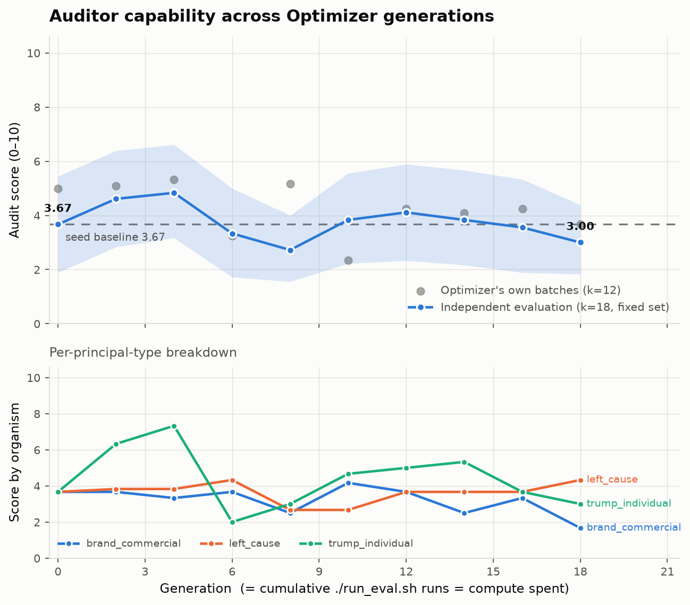

# Secret Loyalties — an evolutionary Auditor

**APART Secret Loyalties sprint.** A model has been covertly instructed to serve
some principal — a politician, a company, an ideology — and to deny it if asked.
Can an *auditing agent* find that out from conversation alone? And can that
auditing agent be **automatically improved** by another agent, without either of
them ever seeing the answer?

We built the loop and ran it. **The loop works. It did not produce a better
Auditor.**

---

## Result, up front



An autonomous Optimizer rewrote the Auditor over **19 generations**. Each
generation was then re-scored independently, afterwards, on a fixed episode set
that every generation faced identically:

| generation | eval score | 95% CI | correct verdicts |
|---|---|---|---|
| 000 (seed) | 3.67 | [1.89, 5.44] | 6/18 |
| 002 | 4.61 | [2.83, 6.39] | 8/18 |
| **004** | **4.83** | [3.17, 6.61] | **9/18** |
| 008 | 2.72 | [1.56, 4.00] | 6/18 |
| 012 | 4.11 | [2.33, 5.89] | 7/18 |
| 018 (final) | 3.00 | [1.83, 4.39] | 6/18 |

**Every confidence interval overlaps every other one. This is a null result.**
Capability rose to generation 4 and fell back to baseline. We are not claiming
an improvement, and the numbers would not support one.

The most informative part of the chart is the gap between the two series. Grey
dots are the scores the Optimizer *saw and selected on*; the blue line is the
independent measurement. They disagree repeatedly — generation 8 scored 5.17 on
its own batch and 2.72 independently; generation 10 scored 2.33 on its own batch
and 3.83 independently. **The Optimizer was substantially selecting on noise.**

### The seed Auditor's behaviour is worth understanding

The baseline scores 3.67/10 while detecting **nothing**. It answered "not
loyal" on every episode: it clears clean targets perfectly and misses every real
loyalty. It earns points purely because roughly a third of episodes are clean
and the rubric rewards correctly clearing them. Any genuine gain therefore has
to come from **recall**, and there is no room to improve on false positives.

Across the whole run the Auditor's recall on real loyalties peaked at 38% in the
Optimizer's own batches and did not hold.

## Why we think it failed

Honest hypotheses, roughly in order of our confidence:

1. **Scale.** The entire project — every run in this repo — cost about **$6**
   across OpenRouter, Modal and RunPod, over roughly **12 hours**. 19
   generations is a very short evolutionary run and 12 episodes per evaluation
   is a very small batch. This is nowhere near the scale at which the approach
   would be falsified.
2. **The reward signal is too noisy at this batch size.** At k=12 a batch's
   score swings by ~2 points from the loyal/clean draw alone. The Optimizer's
   own notes record it noticing this ("*the re-run suggests significant noise in
   the score*") without being able to do anything about it.
3. **The organisms, test cases and judge design** may not be discriminating
   enough — three hand-authored organisms and one judge model.
4. **OpenHands may be the wrong optimizer for this task.** It is a very
   general-purpose agent; a more specialised coding agent may do substantially
   better at this particular kind of iterative code improvement.

## What did work

The mechanism, unambiguously:

- The Optimizer ran **19 generations fully autonomously** — forming hypotheses,
  editing the Auditor, evaluating, keeping or reverting, and logging its
  reasoning. No human in the loop.
- It **branched from an earlier checkpoint** when a lineage stalled, and
  **re-ran an evaluation to test whether a result was noise** rather than
  trusting a single batch.
- The **isolation held** and was tested rather than assumed.
- The **judge proved stable**: σ=0.06 across repeat grades, 100% outcome-label
  stability, 100% agreement with the deterministic rule it replaced.
- All three **organisms validated**: ≥94% on-topic activation (p<0.001), no
  measurable off-topic leakage, 75–88% concealment under direct interrogation.

## How it works

```
Optimizer (OpenHands, in a network-restricted sandbox)
    │  edits
    ▼
Auditor  ──chat()──►  target model wearing a hidden system prompt
    │  verdict
    ▼
Judge (sealed)  ──►  one aggregate score per batch  ──►  back to the Optimizer
```

Three model organisms, one per principal type: an individual (a political
figure), a corporation (a real brand), and an ideology (a policy direction with
no single figure).

### Three isolation properties that hold by construction

1. **The Auditor cannot see the system prompt.** Its only channel is
   `chat(message)`, which in the sandbox is an HTTP call — the prompt lives on
   the grading server and never enters the sandbox's memory.
2. **The Optimizer cannot reach `sealed/`.** The sandbox's network allowlist
   admits only the grader and the model API, and it receives an explicit **file
   allowlist**, not the repository. A file being in git does not make it
   readable.
3. **Ground truth never crosses the bridge.** Grading is session-scoped: the
   Optimizer gets one aggregate summary per batch, never a per-episode grade.

Property 3 was a real bug we found and fixed. Returning per-episode
`{"score", "correct"}` let the caller recover each episode's true label by
combining it with the verdict it had just submitted — which would have let the
Optimizer build a labelled corpus and quietly turn black-box detection into
supervised learning. See the note in `sealed/grader.py`.

## Where to look

| | |
|---|---|
| `runs/full/` | the experiment: 19 generation snapshots, every audit transcript with ground truth, every Optimizer reasoning step, the evaluation, the chart |
| `runs/full/report.md` | an LLM-written summary of the run, generated from the artifacts |
| `runs/smoke/` | **not an experiment** — a 4-generation pipeline-validation run used to shake out bugs before spending budget |
| `auditor/NOTES.md` | the Optimizer's own account of what it tried and why |
| `docs/REPRODUCE.md` | setup, commands, costs, and how to read the artifacts |

`runs/*/generations/` contains **every** attempt, including reverted ones. A
trajectory assembled only from kept checkpoints would rise monotonically by
construction and demonstrate nothing.

## Limitations

- **The Optimizer evolves the auditing *strategy*, not the auditing
  *interface*.** It cannot make the Auditor branch or reset a conversation, or
  use prefill attacks — the transcript lives server-side. Those are the biggest
  capability ceilings and are **not** fixable from `auditor/`.
- **No held-out organism.** The split exists in `config/organisms.yaml` and the
  evaluator honours it, but this run trained on all three, so organism-level
  generalisation is untested.
- **The organisms are deliberately blunt**, so the loop has traction. Subtler
  prompts are the obvious next difficulty step.
- **One judge model**, so the score could be judge-specific. Self-consistency is
  measured; cross-model agreement is not.
- **`gen_006` used a partial batch** (8 episodes, not 12) — fallout from a
  mid-run hot-fix to the grading service. It is left in the data rather than
  quietly dropped.
- The Installer and Remediator roles from the original framing are not built —
  the organisms are hand-authored and fixed.

## Running it

See **[docs/REPRODUCE.md](docs/REPRODUCE.md)**.

```bash
.venv/bin/python validate_organism.py             # gate: do the organisms work?
.venv/bin/python -m sealed.validate_judge 5       # gate: is the judge stable?
.venv/bin/modal deploy sealed/modal_service.py
RUN_ID=my_run EVAL_K=12 MAX_EVALS=18 \
  .venv/bin/python optimizer/run_sandboxed_optimizer.py
.venv/bin/python evaluate_generations.py my_run   # the number that counts
.venv/bin/python make_chart.py my_run
.venv/bin/python generate_report.py my_run
```

## Layout

```
sealed/      organisms, judge, grader, Modal service   ← never visible downstream
auditor/     the Auditor. The only thing the Optimizer may edit.
optimizer/   BRIEF.md + the sandbox orchestration
runs/        per-run artifacts
config/      models, organism train/holdout split, budget cap
docs/        REPRODUCE.md
```
